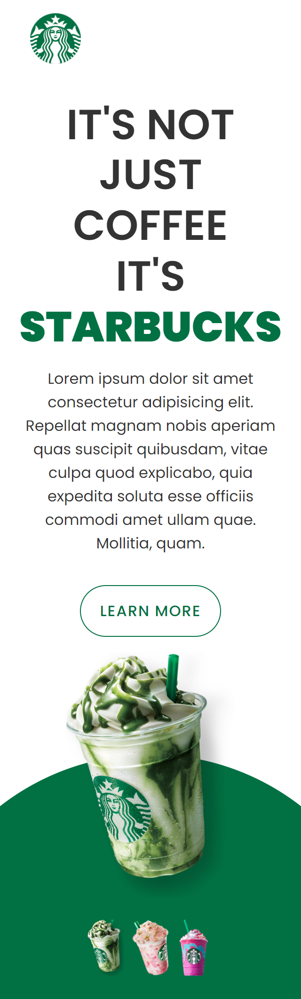

<h1 id="top"> Starbucks Coffee </h1>

> Starbucks Responsive Landing Page Website Design usando Html CSS &amp; Javascript

 

 

### Após assistir as vídeos aulas do evento Missão programação do zero na plataforma DevClub, administrada pelo instrutor [Rodolfo Mori](https://www.instagram.com/rodolfomorii/) , procurei no [Figma](https://www.figma.com/community/file/1069619517324835361) um modelo parecido da página Starbucks Coffe e fiz meu projeto! Responsivo com alguns efeitos hovers e efeito de clique!

 

## 💻 Tecnologias utilizadas

- Html
- CSS
- Javascript
- Git
- Github
- VS Code

<a href="#top" style="margin-right:10px">⬆️ Voltar ao topo</a>

 
