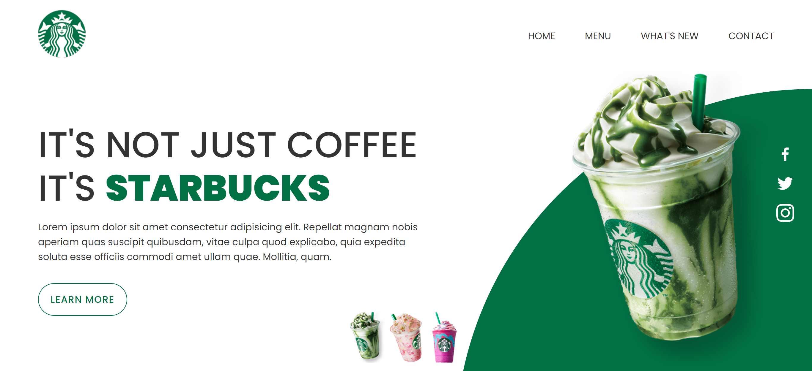

<h1 align="center" id="top"> Starbucks Coffee </h1>

Após assistir as vídeos aulas do evento Missão programação do zero na plataforma DevClub, administrada pelo instrutor [Rodolfo Mori](https://www.instagram.com/rodolfomorii/), procurei no Figma um [layout](https://www.figma.com/community/file/1069619517324835361) da página Starbucks Coffe e fiz meu projeto! Responsivo com alguns efeitos hovers e efeito de clique!

  <a href="#-tecnologias">Tecnologias</a>&nbsp;&nbsp;&nbsp;|&nbsp;&nbsp;&nbsp;
  <a href="#-projeto">Projeto</a>&nbsp;&nbsp;&nbsp;|&nbsp;&nbsp;&nbsp;
  <a href="#-layout">Layout</a>&nbsp;&nbsp;&nbsp;|&nbsp;&nbsp;&nbsp;
  <a href="#memo-licença">Licença</a>

  

 

  

 

## 🚀 Tecnologias

Esse projeto foi desenvolvido com as seguintes tecnologias:

- HTML e CSS
- JavaScript
- Git e Github
- Figma

## 💻 Projeto

Starbucks Landing Page Website com Design Responsivo utilizando HTML, CSS & Javascript.

- [Visite o projeto online](https://barbaraishioka.github.io/starbucks/)

## 🔖 Layout

Você pode visualizar o layout do projeto através [desse link](https://www.figma.com/community/file/1069619517324835361). É necessário ter conta no [Figma](https://figma.com) para acessá-lo.

## :memo: Licença

Esse projeto está sob a licença MIT.

#

Feito com ♥ by [Bárbara Ishioka](https://www.linkedin.com/in/barbaraishioka/).

<a href="#top">⬆️ Voltar ao topo</a>

